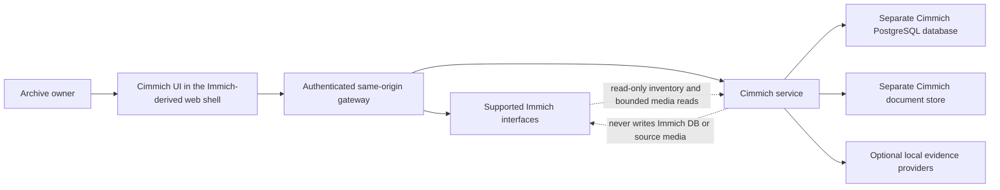

# Cimmich development guide

This guide is for contributors who want to understand the repository before
running or changing it. For product behavior, begin with the
[walkthrough](docs/WALKTHROUGH.md). For contribution expectations, read
[CONTRIBUTING.md](CONTRIBUTING.md).

## Architecture at a glance

Cimmich is an additive companion, not an alternate Immich database writer.



The service owns Cimmich state, migrations, jobs, decisions and projections.
Immich remains the base photo-management product and owns authentication and
original media.

## Repository map

| Path | Purpose |
| :--- | :--- |
| `service/` | Independent Node service, canonical Cimmich API and tests |
| `ui/` | Immich-derived pnpm workspace containing the Cimmich product UI |
| `migrations/` | Ordered, forward-only Cimmich database migrations |
| `providers/` | Optional provider adapters, manifests and pinned Python requirements |
| `ops/` | Deployment and operational support material used by bounded environments |
| `tools/` | Install, lifecycle, provider, migration and acceptance operators |
| `demo/` | Licensed fictional Cedar House and Space Trip demonstration material |
| `docs/` | Product contracts, operations, release evidence and project history |
| `compose.yaml` | Root source-build deployment definition consumed by the installer and lifecycle operator |

The public tree contains code and synthetic evidence only. Real archive media,
embeddings, database dumps, credentials, machine paths and private evaluation
material do not belong in the repository.

## Two deliberate JavaScript workspaces

| Workspace | Runtime | Package manager | Why |
| :--- | :--- | :--- | :--- |
| `service/` | Node 22 | npm with `service/package-lock.json` | Cimmich's local service is a small independent application. |
| `ui/` | Node 22 in CI; Node 24 in the production image | pnpm 11.6.0 with `ui/pnpm-lock.yaml` | The UI retains the Immich web monorepo and workspace structure. |

Do not run npm inside `ui/` or pnpm inside `service/`. There is no competing
lockfile within either workspace.

Provider contract tests use Python 3.12 in public CI. Install a provider's
pinned `requirements.txt` in a dedicated virtual environment before running
that provider locally; do not combine optional provider environments.

`ui/packages/sdk` is **not `node_modules`**. It is the small, generated
`@immich/sdk` TypeScript source workspace retained from the Immich web
foundation so the inherited client builds with the UI. Installed dependency
trees are ignored and must never be committed.

Upstream lineage and licensing are recorded in [NOTICE.md](NOTICE.md),
`ui/LICENSE` and [ui/CIMMICH_FORK.md](ui/CIMMICH_FORK.md).

## Local prerequisites

- Node 22 for local work, matching the checked-in CI jobs;
- Corepack and pnpm for `ui/`;
- npm for `service/`;
- Python 3.12 for provider contract and provider implementation tests;
- Docker with Compose v2 for integration and product lifecycle work; and
- a clean checkout without dependency directories from another platform.

## Install dependencies

Service:

```sh
cd service
npm ci
```

UI:

```sh
cd ui
corepack enable
pnpm install --frozen-lockfile
pnpm --filter @immich/sdk build
```

## Run the product and synthetic data

For an end-to-end product journey, use one of the supported compositions rather
than assembling services from memory:

- [install beside an exact Immich 3.1.0 instance](INSTALL.md) with the root
  operator; or
- [run the isolated Cedar House demo](demo/cedar-house-v1/README.md), which
  creates its own loopback-only Immich and Cimmich stack with fictional data.

The root `compose.yaml` builds the checked-in service and UI Dockerfiles. The
installer creates the `runtime.env` needed by lifecycle commands; a hand-written
root `.env` is not interchangeable with that operator state.

The supported stacks keep the owner API container-internal behind the gateway.
Consequently, copying `ui/web/.env.example` and starting Vite alone is not a
complete, supported product route. There is not yet a supported one-command
live-reload composition for the service, database, Immich and UI together. Use
the root Compose stack or the synthetic demo for cross-layer behavior, and use
focused workspace tests while iterating. Keep secrets out of UI environment
files when developing a future local composition.

## Run the normal checks

Service:

```sh
cd service
npm run check:syntax
npm run format
npm run lint
npm test
```

UI:

```sh
cd ui/web
pnpm run format
pnpm run lint
pnpm run check:svelte
pnpm run check:typescript
pnpm run test -- --run
pnpm run build
```

Run the smallest affected test while iterating, then finish with the relevant
workspace gate. Do not use a broad green suite to hide a missing focused test.

## Cross-layer and release checks

Changes crossing data, provider or lifecycle boundaries may also require:

```sh
PYTHON_BIN=python3.12 ./tools/run_provider_contract_tests.sh
./tools/run_migration_runner_acceptance.sh
./tools/run_synthetic_acceptance.sh
./tools/run_publication_scan.sh
```

The provider runner uses `PYTHON_BIN` and discovers each provider contract. For
a provider implementation test, activate that provider's isolated environment
with its pinned requirements first, then pass its Python executable through
`PYTHON_BIN`. The contract suite itself does not install optional model stacks.

The named release process adds clean-bundle builds, exact Immich compatibility,
stock-Immich and fictional-demo lifecycle checks, browser journeys, backup and
restore, update, diagnostics, removal and logged-out artifact verification.
Consult [docs/RELEASE_STRATEGY.md](docs/RELEASE_STRATEGY.md); do not infer that a
green `main` commit is an installable release.

## Fork and compatibility maintenance

The UI shell is derived from Immich, but Cimmich does not claim to track every
upstream release automatically. Each supported Immich version is added only
after its API, authentication, asset, Face/Person and lifecycle journeys pass
against a stock instance.

Do not wholesale-sync upstream UI changes or silently change the retained SDK
version. A port should identify the upstream range, preserve licence and notice
material, keep Cimmich-owned routes and data boundaries distinct, and rerun the
exact compatibility proof. See [ui/CIMMICH_FORK.md](ui/CIMMICH_FORK.md),
[NOTICE.md](NOTICE.md) and [docs/RELEASE_STRATEGY.md](docs/RELEASE_STRATEGY.md).

The historical public seed preserved the adapted-file notices and licence
lineage, but it did not preserve an exact upstream commit plus reproducible
patch series. Do not invent that missing provenance. The next upstream port
must record its exact starting commit, retained patch inventory and repeatable
port procedure alongside the compatibility proof.

## Data and authority rules

Before changing a data path, preserve these invariants:

- Immich is the base product; Cimmich owns only separate derived state.
- Cimmich does not directly write the Immich database or source-media bytes.
- Face, Head, Body and Presence are different evidence types.
- Model output is candidate evidence, never automatic identity authority.
- Consequential owner decisions need visible failure, replay, conflict and Undo
  behavior.
- Cimmich collection reads must apply viewing mode before exposing records,
  counts or mutation targets.
- Applied migrations are immutable. Add the next contiguous migration rather
  than editing history.

Read [PRIVACY.md](PRIVACY.md) and
[docs/PRIVACY_BOUNDARY.md](docs/PRIVACY_BOUNDARY.md) before working with media,
identity, documents, diagnostics, external clients or providers.

## Migration expectations

Migration changes must prove:

- a fresh database;
- supported upgrade paths;
- interruption and restart behavior;
- concurrency and advisory locking;
- ordered checksums and drift rejection; and
- semantic state after migration.

Never repair a released migration in place. An apparent convenience fix can
make an existing installation impossible to verify or restore.

## Maintainability policy

The Community Preview accumulated several large implementation files during
the product sprint. They are tested but harder to review than they should be.
`tools/check_source_shape.mjs` records temporary ceilings and fails CI when an
oversized file grows or a new production file exceeds 1,000 lines.

The checker enforces those ceilings; it does not detect every touched domain or
automatically require a file to shrink. Maintainer policy is to reduce the debt
when a coherent extraction fits the change:

1. extract one coherent domain, service, state manager or presentation module;
2. keep behavior covered while moving it;
3. reduce the recorded ceiling in the same pull request; and
4. do not add a new exception.

Use named constants for policy, limits, timeouts, retry counts and thresholds.
Self-evident arithmetic, indexes, HTTP status codes, geometry percentages and
small presentation transitions do not need performative constants.

## AI-assisted changes

AI-assisted implementation receives the same review, privacy, licensing and
test requirements as any other contribution. Disclose material code-writing
assistance accurately in the pull-request description.

See [GOVERNANCE.md](GOVERNANCE.md) for authorship and authority rules.

## Where to continue

- [Contributing workflow](CONTRIBUTING.md)
- [Project governance](GOVERNANCE.md)
- [Technical documentation index](docs/README.md)
- [Security policy](SECURITY.md)
