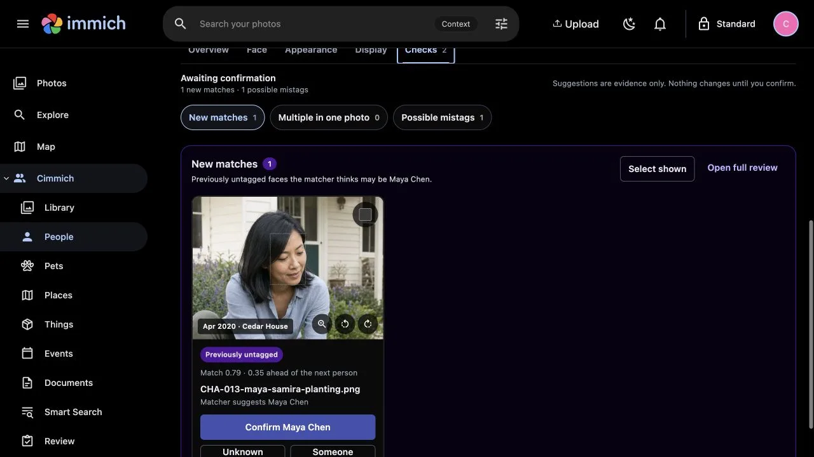
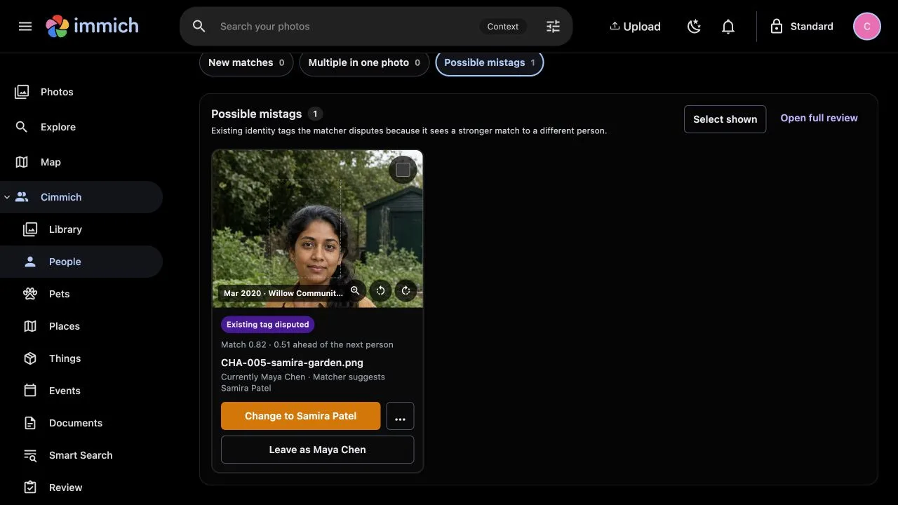
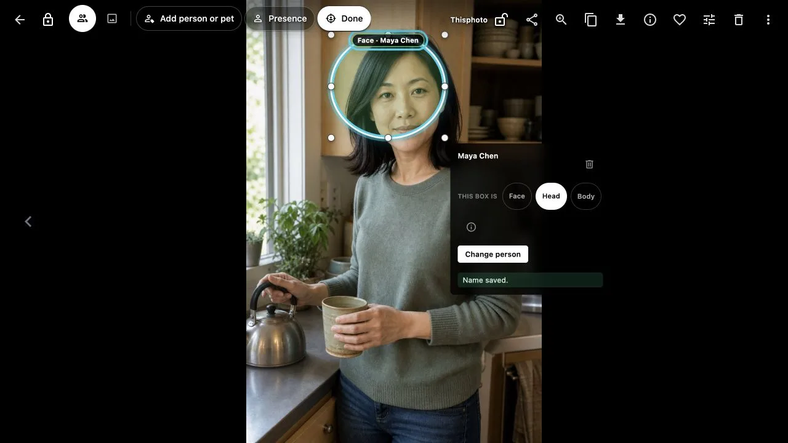
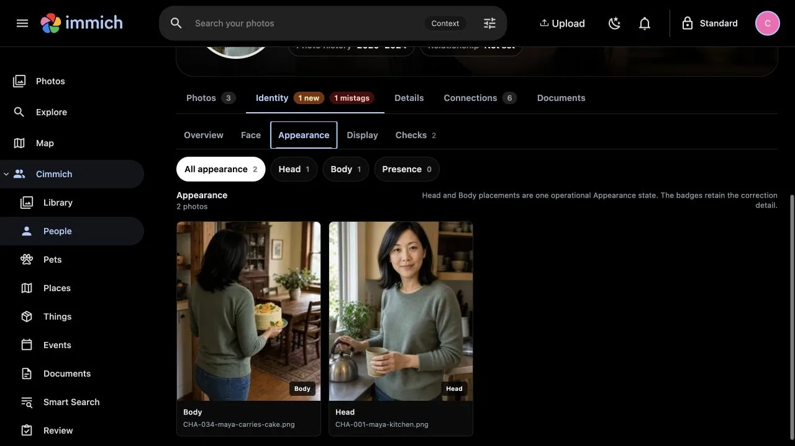
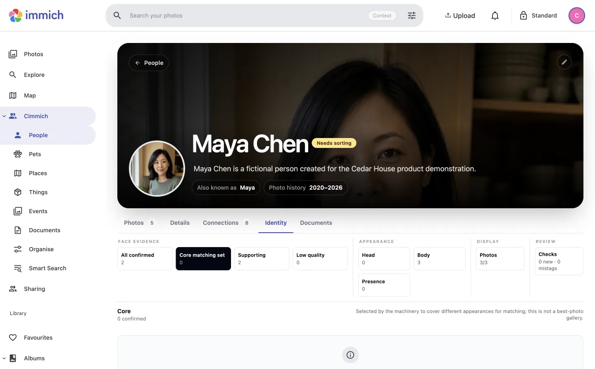
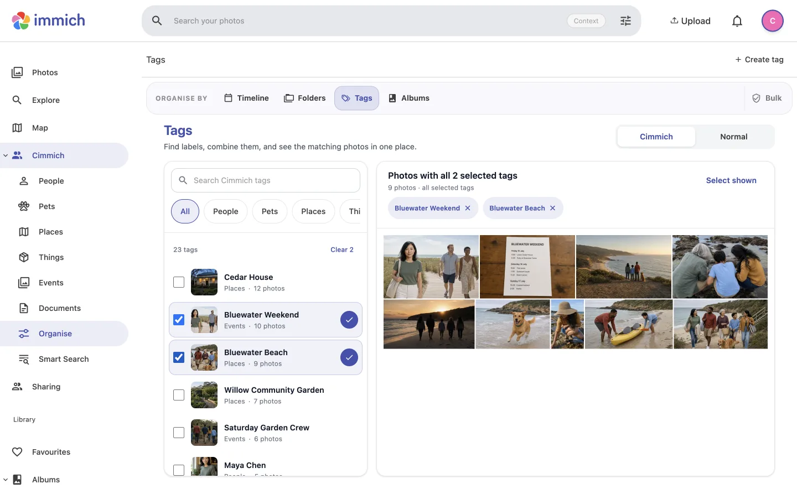
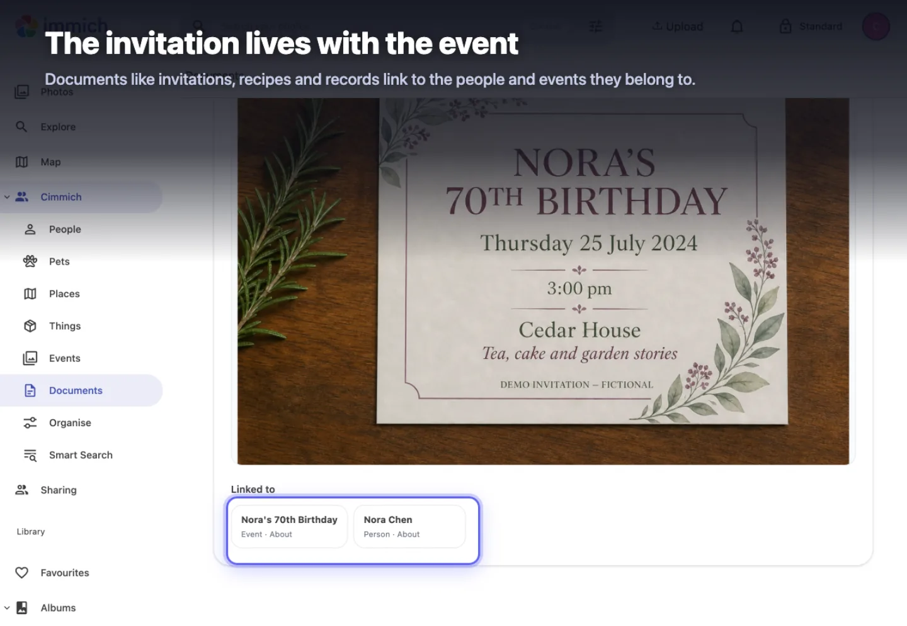

# Cimmich

<p align="center">
  
</p>

> **The archive already contains the story. Cimmich helps you keep it connected.**

**Cimmich is the open-source, local-first memory layer for Immich.** Confirm a
person, press Refresh, and Cimmich uses what it learned to find the next
possibilities. Then connect People, Pets, Places, Things, Events and Documents
so each detail becomes another way back through the archive.

Your archive already holds the hard part: the names, relationships and stories
only you can recognise. Cimmich turns that knowledge into new ways to browse,
search and return to the photos that matter.

[Explore the product](https://benjihagenhart.com/cimmich/) · [Open the Guide](https://benjihagenhart.com/cimmich/guide/) · [Install Cimmich](INSTALL.md) ·
[Try fictional data](demo/cedar-house-v1/README.md) · [Understand privacy](PRIVACY.md) ·
[Contribute](CONTRIBUTING.md)

> [!NOTE]
> **OpenAI Build Week - Apps for Your Life.** Cimmich's original submission was
> built with **Codex powered by GPT-5.6 Sol** and remains preserved at the exact
> [`v1.0.0-build-week` tag and release](https://github.com/cimmich/cimmich/releases/tag/v1.0.0-build-week):
> [read the original submission README](https://github.com/cimmich/cimmich/blob/v1.0.0-build-week/README.md) ·
> [watch the three-minute demo](https://youtu.be/CfR_r0n4deQ) ·
> [inspect the Build Week evidence](https://github.com/cimmich/cimmich/blob/v1.0.0-build-week/docs/BUILD_WEEK_EVIDENCE.md).
> Living product development continues on `main` without rewriting that
> historical release.

> [!IMPORTANT]
> Cimmich is an unofficial companion project. It is not affiliated with or
> endorsed by Immich or OpenAI.

> [!NOTE]
> **Community Preview 20 is the current named preview.** Its guided Docker install
> has been exercised on macOS and Linux with exact Immich 3.1.0. Windows has not
> yet been tested. Install the [latest named release](https://github.com/cimmich/cimmich/releases/latest),
> not an arbitrary snapshot of `main`.


## The matcher improves with you

### Confirm a person. Refresh. Find the next ones.

Every confirmation and correction gives Cimmich better evidence. Press Refresh
and Cimmich rebuilds what it knows about that person from the Faces you have
confirmed, then searches again and brings the next possibilities back to you.
You never manage embeddings. You just say who it is.

The review experience has four parts:

1. **New matches.** Review a Face Cimmich thinks may belong to someone.
2. **Possible mistags.** Revisit an existing tag when someone else is a much
   stronger fit.
3. **Head and Body.** Keep the Person attached to a difficult photo without
   treating that region as Face evidence.
4. **Refresh.** Cimmich rebuilds that Person's Core matching set from your
   latest confirmed Faces, then searches again for more review work.

<table>
  <tr>
    <td width="33%">
      
      <br><strong>Confirm a new match.</strong> Cimmich finds the candidate. The
      owner decides whether the Person is right.
    </td>
    <td width="33%">
      
      <br><strong>Question the tag.</strong> Sometimes the identity is wrong.
      Sometimes the evidence type is.
    </td>
    <td width="33%">
      
      <br><strong>Correct the evidence.</strong> Change Face to Head or Body
      without losing the Person tag.
    </td>
  </tr>
  <tr>
    <td colspan="3">
      
      <br><strong>Review what comes back.</strong> New possibilities and doubtful
      existing tags wait together in the Person's Checks view.
    </td>
  </tr>
  <tr>
    <td colspan="3">
      
      <br><strong>Keep the tag. Fix the evidence.</strong> Head and Body preserve
      the person-to-photo relationship without teaching the Face matcher from
      the wrong region.
    </td>
  </tr>
</table>

## What Cimmich adds

Immich is where your photos live. Cimmich helps you remember who is in them,
what was happening and how each part of the archive connects.

- **Matching that improves with use.** Confirm and correct people, then Refresh
  so Cimmich can re-evaluate its matching evidence and search again.
- **Bring the story together.** Connect people, pets, places, events, things and
  documents so every detail becomes another way back through the archive.
- **Make every detail work harder.** Add or correct a name, relationship, event,
  place or document once; Cimmich carries it into people, stories, filters and
  search.
- **Protect and inspect the archive.** Archive Health compares exact and
  possible duplicates, checks one folder against the rest of the archive,
  reviews likely rotation problems, scans independent photo backups and
  verifies scheduled Cimmich database backups without deleting source media.
- **Explore People with context.** Filter People and their photographs by
  Privacy bucket, Tags and Labels, Places, Events and Things while keeping Face,
  Head, Body and Presence evidence distinct.
- **Keep what you add.** Cimmich stores its knowledge separately from Immich and
  lets you export your decisions and linked documents.

**Cimmich keeps Face, Head, Body and Presence evidence in its own system.
Native Immich manual face assignments do not train or damage Immich's
recognition model.** The distinction is about recording different kinds of
owner knowledge and controlling which evidence Cimmich's matcher may use.

<table>
  <tr>
    <td width="50%">
      
      <br><strong>Evidence without invented certainty.</strong> Identity shows
      separate Face and appearance categories; an empty Core set is honest too.
    </td>
    <td width="50%">
      
      <br><strong>Combine what you already know.</strong> Intersect people,
      places, events and other tags across the library.
    </td>
  </tr>
  <tr>
    <td width="50%">
      
      <br><strong>Memories can overlap.</strong> Build trips, activities and life
      periods from existing photographs and folders.
    </td>
    <td width="50%">
      
      <br><strong>Keep the record with the memory.</strong> Link invitations,
      receipts and other documents to the people and events they belong to.
    </td>
  </tr>
</table>

The screenshots use the fictional, rights-cleared Cedar House demonstration
archive. The invitation image is an annotated product capture; the others show
the named interface directly. [Explore the product and open the exact steps in
the Guide](https://benjihagenhart.com/cimmich/guide/).

## Is the Community Preview for you?

| A reasonable fit for testing today                                | Not yet proved by this preview                                         |
| :---------------------------------------------------------------- | :--------------------------------------------------------------------- |
| You already run exact Immich 3.1.0                                | You need compatibility with another Immich version                     |
| You can run the checked-in installer and inspect its Compose file | A tested Windows installation path                                     |
| You can keep a separate Cimmich backup                            | You need stable APIs and schemas across releases                       |
| You want a local, single-owner companion                          | You need Internet-facing or multi-user deployment                      |
| You want inspectable suggestions and manual decisions             | You need automatic identity acceptance or certified biometric accuracy |

## Install beside Immich

Download the named Cimmich bundle and `SHA256SUMS` from the
[latest release](https://github.com/cimmich/cimmich/releases/latest), verify it,
then extract the bundle:

```sh
./tools/install.sh --check
./tools/install.sh
```

Open <http://127.0.0.1:3413>, sign in through Immich, and complete the guided
library preview. Cimmich asks for a dedicated read-only Immich API key only in
its signed-in Settings screen - never in `.env` or an AI conversation.

Read [INSTALL.md](INSTALL.md) before starting. It covers checksum verification,
host addressing, first-run expectations, backups, updates, diagnostics and
confirmation-gated Cimmich-only removal.

## Privacy and control

Cimmich is designed to be additive and removable:

- Cimmich has its own PostgreSQL database, configuration, documents and backups.
- Immich continues to own and serve original media.
- Cimmich treats Immich as read-only. Its service and Cimmich UI paths do not
  create, update or delete Immich albums, memberships, tags, metadata or media.
- Product ports bind to loopback by default.
- Core organisation works without a model or model-provider API key.
- Optional local providers produce observations, not identity decisions.
- Optional hosted clients may disclose what the operator chooses to send them;
  Cimmich cannot make third-party software private.
- Private mode filters presentation inside an authenticated session. It is not
  encryption, an ACL or protection from the host administrator.

Read the plain-language [privacy guide](PRIVACY.md), the technical
[privacy boundary](docs/PRIVACY_BOUNDARY.md), and [SECURITY.md](SECURITY.md).

## Documentation

| I want to…                                               | Start here                                           |
| :------------------------------------------------------- | :--------------------------------------------------- |
| Explore the product and follow the exact tasks           | [Cimmich Guide](https://benjihagenhart.com/cimmich/guide/) |
| Read the complete repository reference                   | [Detailed user guide](docs/USER_GUIDE.md)            |
| Install, update, back up or remove it                    | [Installation and operations](INSTALL.md)            |
| Understand data and network behavior                     | [Privacy guide](PRIVACY.md)                          |
| Understand or generate photo summaries                   | [Photo summaries](docs/SUMMARIES.md)                 |
| Use or operate optional Local AI review                  | [Local AI review](docs/LOCAL_AI_REVIEW.md)           |
| Resolve a common question                                | [FAQ](docs/FAQ.md)                                   |
| Understand the repository                                | [Development guide](DEVELOPMENT.md)                  |
| Map product experiences to their implementation          | [Product architecture](docs/PRODUCT_ARCHITECTURE.md) |
| Propose a change                                         | [Contributing guide](CONTRIBUTING.md)                |
| Understand project authority and AI-assisted development | [Governance](GOVERNANCE.md)                          |
| Inspect release and journey evidence                     | [Documentation index](docs/README.md)                |

## Current limitations

- Community Preview, not a general-availability release.
- Exact Immich 3.1.0 only; each additional version needs its own compatibility
  proof.
- Tested guided-install hosts are macOS and Linux. Native Windows PowerShell
  and WSL2 are untested in this release.
- Internet-facing and multi-user deployment are outside this preview's tested
  boundary.
- Face-detector and embedding-model weights are not bundled. Compatible local
  face-analysis providers extract observations and embeddings; Cimmich owns
  matching, reference evaluation and the review workflow.
- No biometric-accuracy or demographic-fairness claim is made.

## Develop and contribute

Cimmich contains two deliberate JavaScript workspaces: a Node 22/npm service
and an Immich-derived Node 24/pnpm UI. `ui/packages/sdk` is checked-in generated
source - not `node_modules`.

Read [DEVELOPMENT.md](DEVELOPMENT.md) before installing dependencies. Small,
reviewable documentation, test and defect fixes are welcome under the
[contribution guide](CONTRIBUTING.md) and [code of conduct](CODE_OF_CONDUCT.md).

## Project history

Cimmich began as a bounded **OpenAI Build Week - Apps for Your Life** project.
The exact submission remains preserved as the
[v1.0.0 Build Week release](https://github.com/cimmich/cimmich/releases/tag/v1.0.0-build-week),
with its [prior-work disclosure](docs/BUILD_WEEK.md) and
[privacy-cleared evidence index](docs/BUILD_WEEK_EVIDENCE.md). Living product
development continues on `main` without rewriting that historical release.

Product direction, acceptance and release authority are held by Benji.
Living Cimmich development uses substantial AI assistance coordinated and
accepted under Benji's product and release authority. The exact Build Week
tooling and inherited Immich-derived web foundation are separately attributed. See
[GOVERNANCE.md](GOVERNANCE.md) for the decision, acceptance and attribution
model.

## Licence and lineage

Cimmich is distributed under the [GNU AGPL v3](LICENSE). It contains and adapts
Immich web source under preserved upstream terms. See [NOTICE.md](NOTICE.md) and
[the UI lineage record](ui/CIMMICH_FORK.md).
