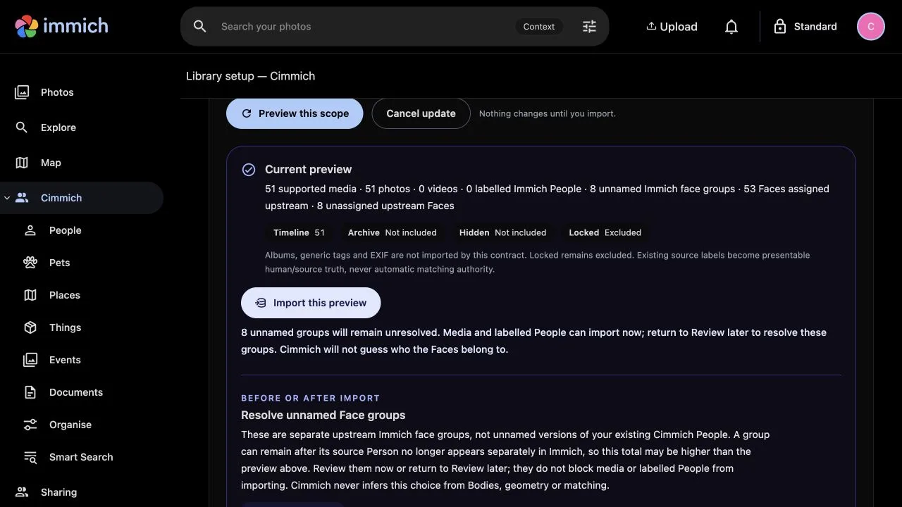
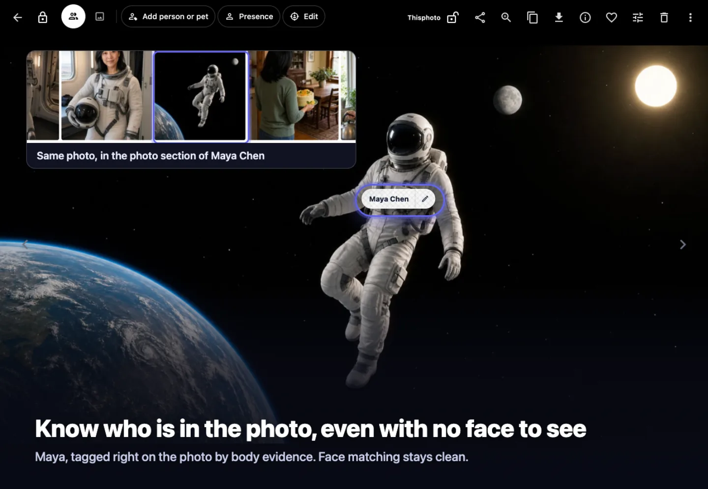
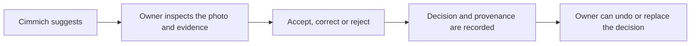
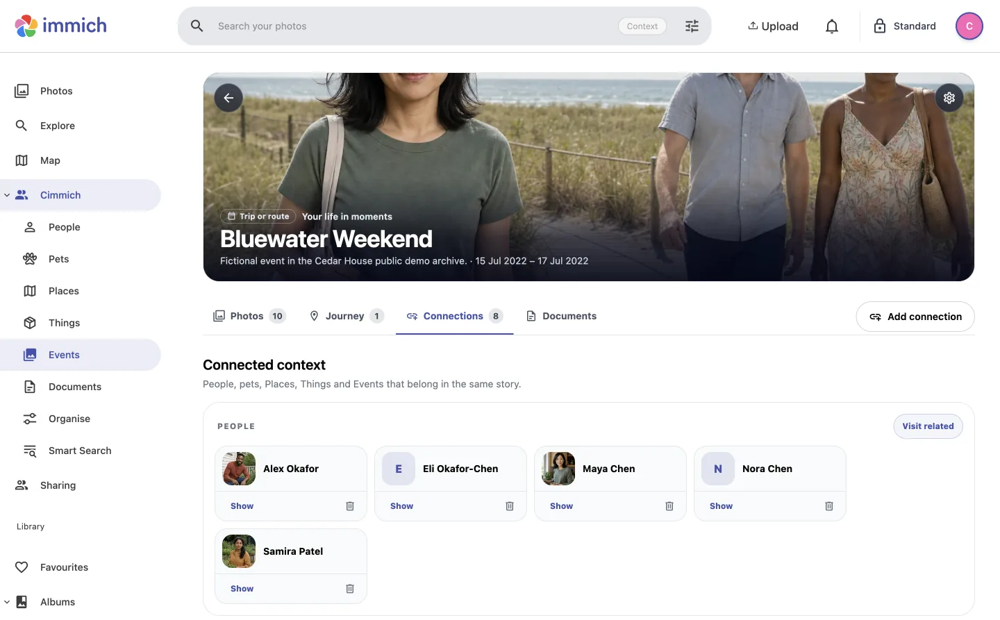
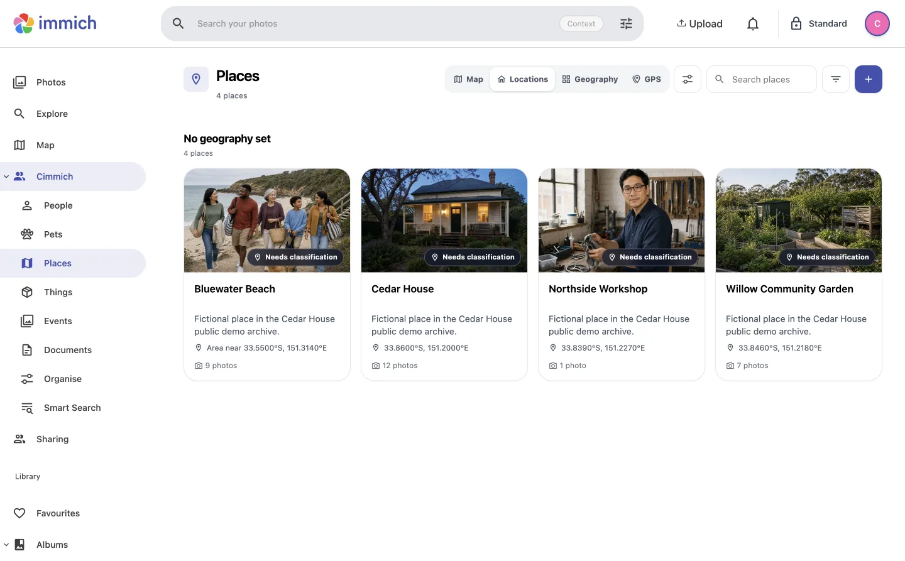

# A tour of Cimmich

This walkthrough uses **Cedar House**, Cimmich's fictional, rights-cleared
demonstration archive. It shows how the product fits around Immich without
requiring access to anybody's private library.

> [!NOTE]
> Cedar House demonstrates product behavior and lifecycle controls. It is not a
> biometric-accuracy, demographic-fairness or real-person consistency benchmark.

[Install Cimmich](../INSTALL.md) · [Run the isolated demo](../demo/cedar-house-v1/README.md) ·
[Read the privacy guide](../PRIVACY.md) · [Use the detailed guide](USER_GUIDE.md)

This is the short visual tour. For every current section, review action and
owner boundary, continue with the [detailed user guide](USER_GUIDE.md).

## 1. Inspect the scope before importing

After installation, open Cimmich's local gateway at
<http://127.0.0.1:3413>. Sign in with the normal Immich account, add the
dedicated read-only key in Cimmich Settings, then preview the exact account,
permissions, library lanes and counts. Nothing imports until the owner confirms
this screen.

On this preview, **upstream** means the existing Immich library; the named
lanes are its Timeline, Archive, Hidden and Locked areas. **Source truth** means
a label already stored by Immich, while **matching authority** asks whether an
observation may be used as a future matching example. The immediate decision is
simply whether the account, included areas and counts are expected.

The familiar navigation is intentional: Cimmich's web shell is derived from
Immich so the existing photo experience remains close at hand. Cimmich is still
a separate companion with its own service, database, documents and lifecycle.

## 2. Begin with the library you already own

Cimmich appears inside the familiar Immich shell, but it remains a separate
companion. Immich continues to own authentication, original media and its own
database. Cimmich adds a connected layer for the people, pets, places, things,
events and documents that make the library meaningful.

The first screen is intentionally visual. You can open a featured story or go
straight to a directory without first learning Cimmich's data model.

## 3. Give a person more than a face gallery

A Person brings photographs, relationships, identity evidence and linked
documents into one place. In the Cedar House archive, Maya's page connects her
ordinary photographs with the Space Trip story without flattening every
appearance into face recognition.

Open **Identity** to inspect why Cimmich knows what it knows:

Cimmich records four evidence types separately:

- **Face:** a usable face observation;
- **Head:** a visible head without enough facial detail;
- **Body:** an appearance or body observation;
- **Presence:** the owner's knowledge that someone is in the photograph.

Only appropriate, owner-confirmed evidence can support Cimmich matching. A
Body or Presence record can complete the memory without silently becoming a
face reference.

Native Immich manual face assignments do not train or damage Immich's
recognition model. Cimmich's separate evidence types govern what its matcher
may use; they do not repair or retrain Immich.

## 4. Review a suggestion before it becomes a decision

Some of the most valuable photographs do not contain a clear face. The owner
can add Body or Presence evidence directly on the photograph, inspect the
result, and later correct or remove it.

Optional models may propose observations, but they do not accept an identity.
Consequential identity changes remain visible, confirmation-gated and
reversible.

This is the core control loop: a score can bring something to review, but it
cannot decide who a person is. Undo is part of the decision contract, not a
best-effort cleanup after the fact.

## 5. Combine context instead of searching one label at a time

In **Organise → Tags**, choose several Cimmich tags to see their intersection.
For example, selecting **Bluewater Weekend** and **Bluewater Beach** returns
only photographs carrying both contexts.

People, Pets, Places, Things and Events can participate in the same search. The
result is calculated across the complete Cimmich library rather than being
silently capped at the first 5,000 candidates.

The same Organise area can apply Cimmich-owned labels, tags, favourites and
archive choices, then turn reviewed folder groups into collections through a
collision-safe manifest. The preview shows source folders, counts and editable
titles before writing. One operation receipt can undo only the Cimmich
memberships created by that run. Immich albums, tags, metadata, source files and
sidecars remain read-only.

People and Person pages can also be narrowed by Privacy bucket, Tags and
Labels, Places, Events and Things. The People directory keeps its title, modes,
search, sorting, filters and grid size together in one compact top bar. Helpful
tooltips explain the controls without adding permanent instructional copy.
Filters remain visible in the URL so a review can be resumed or shared without
silently changing its scope.

## 6. Check the health of the archive

Open **Archive Health** directly from the navigation. It is a review workspace,
not a cleanup command. Nothing on this surface changes or deletes media.

The four checks answer different questions:

- **Exact copies** finds groups whose complete file bytes have the same SHA-256
  digest. Matching metadata or filenames alone are not enough.
- **Possible duplicates** starts from Immich's visual duplicate groups, then
  shows whether the files are byte-identical, different files, or still need
  verification. Differences such as dimensions, capture time, filename and
  metadata become visible review evidence.
- **Folder Check** compares one folder with the rest of the archive. Its smart
  selector ranks folders with the most duplicate impact first. Select a path to
  see files in that folder beside their counterparts elsewhere, the folders
  they share, and files with no current counterpart outside the selected
  folder. Each copy column aligns its full path, byte size, resolution, capture
  and modified times, location, camera and additional Immich metadata. Changed
  rows are highlighted, and a visible preservation candidate is marked for
  review when the available evidence supports one.
- **Backup Check** scans a configured independent destination read-only. It
  reports exact matches, changed files, files present only in the archive, and
  files present only in the backup.

Each category loads when you open it. Folder Check builds and caches the native
duplicate index once, then scopes the detailed evidence to the selected folder.
Moving between folder candidates does not rerun unrelated exact-copy or backup
checks. Possible duplicate groups appear in small batches, and Folder Check
loads byte detail only for the comparison currently being inspected.

"Only here" means that Cimmich found no current exact or visual-duplicate lead
outside the selected folder. It is not proof that a file is safe to remove. A
recommended visible copy is also review guidance, not deletion proof. A
backup counts as independent only when the operator mounts a separate storage
destination with a distinct storage-domain identity. See the
[read-only backup scan setup](../INSTALL.md#optional-read-only-media-backup-scan).

## 7. Let memories overlap like life does

An Event can collect defining photographs, journey stops, related people,
places, things and documents. Events may represent trips, recurring activities
or longer periods; a photograph can truthfully belong to several contexts at
once.

Connections make the story navigable. From Bluewater Weekend you can move to a
person, place or related event without reconstructing the relationship from a
filename or folder path.

## 8. Keep documents with the memory they explain

Documents such as invitations, receipts and records live in Cimmich's separate
local document store. Their metadata can link to People, Pets, Places, Things
and Events, so the file remains findable through the memory it belongs to.

Imported document bytes are not written into Immich or stored as PostgreSQL
blobs. They participate in Cimmich backup, restore and removal as a declared
part of Cimmich-owned state.

## 9. Turn coordinates into a place you recognise

A Place can begin from GPS, a map point, search or manual creation. It receives
a name, cover, map position, related media and connections. Libraries without
GPS can still create and use Places manually.

Optional outbound address lookup and map imagery are separate operator choices.
They are not required for core organisation.

## 10. Choose what is comfortable to show

Standard, Personal and Private viewing modes are cumulative presentation
filters. Counts, thumbnails and connected records follow the active mode so a
shared screen does not reveal something merely through navigation or an
aggregate count.

Private mode may use an additional local password, but it is not encryption,
an access-control list or a vault. Immich still owns account access, and a host
administrator can access local data. Read [Privacy and data control](../PRIVACY.md)
before using it for sensitive material.

## 11. Stop, back up or remove Cimmich without replacing Immich

Cimmich uses its own Docker project, database, configuration, documents and
optional provider volumes. The checked-in installer creates the private
operator state used by stop, resume, backup, restore and removal.

The guarded operator can produce checksummed backups, portable exports and a
redacted diagnostic report. Confirmed removal targets only Cimmich's exact
project and state directory; it does not remove Immich or source media.

Continue with:

- [Installation, backup, updates and removal](../INSTALL.md)
- [Privacy and network behavior](../PRIVACY.md)
- [Frequently asked questions](FAQ.md)
- [Technical acceptance map](COMMUNITY_PREVIEW_JOURNEYS.md)
